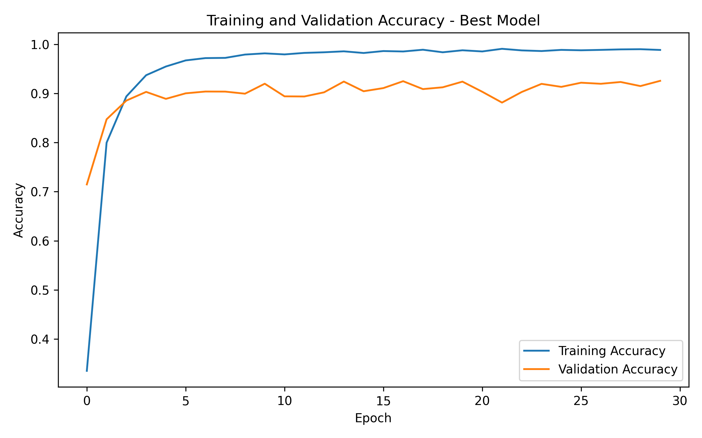
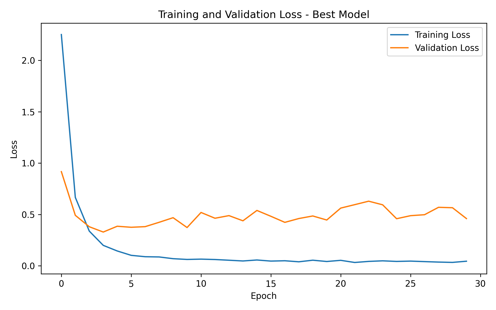
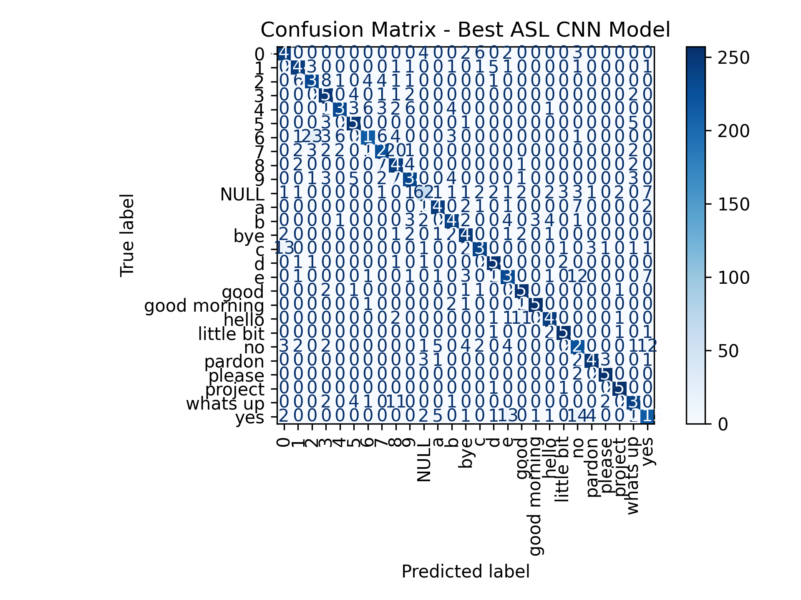

## ***1. Introduction***

---

Sign language is one of the primary means of communication for people with hearing or speech impairments. Among the different sign languages, American Sign Language (ASL) is one of the most widely used, serving hundreds of thousands of individuals across the United States and parts of Canada. Despite its widespread use, communication between ASL users and people unfamiliar with sign language remains a significant challenge in everyday life.

Recent advances in Artificial Intelligence, Computer Vision, and Deep Learning have enabled the development of automated sign language recognition systems capable of translating hand gestures into meaningful information. Such systems can contribute to more accessible communication and improve the interaction between deaf or hard-of-hearing individuals and the general population.

The objective of this project is to develop a Convolutional Neural Network (CNN) capable of recognizing American Sign Language hand gestures from RGB images. Multiple experimental configurations are evaluated by comparing different batch sizes both with and without data augmentation. The models are assessed using several classification metrics in order to identify the best-performing architecture.

***2. Data***
---
The dataset used in this project consists of RGB images representing 27 American Sign Language classes. Each image has a spatial resolution of 128 × 128 pixels and three color channels. The dataset is used to train and evaluate a convolutional neural network for multi-class image classification.

> **Data**
> The data obtained was from 173 volunteers.
>
> A large number of users is defined as [1].
>
> Selected Numbers: 0, 1, 2, 3, 4, 5, 6, 7, 8, 9.
>
> Selected Letters: A, B, C, D, E.
>
> Selected Expressions: Hello, Yes, No, Good, Bye, Good morning, Whats up, Pardon, Project, Little bit, Please.
>
> NULL class, which contains 314 random photos, without any sign language gestures and is the 27th class of the dataset.

> **Images**
>
> Right-handed gesture.
>
> Camera: 3024pixels x 3024pixels.
>
> Color space: RGB.
>
> Total images: 130 from each individual, 5 from each class.
>
> Total images: 22,801
>
> Shots from different angles with minor changes.
>
> Variety of images in background and light.

> **Data Processing**
>
> Resize to 128 pixels x 128 pixels.
>
> Integer values ​​in the range [0, 255] and normalize to 32-bit float in the range [0, 1].

> **Data Storage**
>
> Store processed images in NumPy Tensor "X" 4D (number of photos, height, width and three RGB color channels)
> 
> Store label in NumPy Tensor "Y" 2D (image number, label)

***3. Code***
---

### ***3.1 Import Packages***

---

The required Python libraries are imported to support data manipulation, visualization, deep learning, and model evaluation. TensorFlow and Keras are used for constructing and training the convolutional neural network, while NumPy, Pandas, Matplotlib, and Scikit-learn provide utilities for preprocessing, performance evaluation, and visualization.

```{python}
import os
import gc
import numpy as np
import matplotlib.pyplot as plt
import tensorflow as tf

from tensorflow import keras
from tensorflow.keras.utils import to_categorical
from tensorflow.keras.layers import Conv2D, MaxPooling2D, Flatten, Dense
from tensorflow.keras.models import load_model

from sklearn.model_selection import train_test_split
from sklearn.metrics import confusion_matrix, accuracy_score, precision_score, recall_score, f1_score

os.makedirs("models", exist_ok=True)
os.makedirs("results", exist_ok=True)
```

### ***3.2 Data Loading and Checking***

---

The ASL dataset is loaded into memory and inspected before training. This step verifies that both the image and label arrays have been successfully imported and ensures that the dataset is suitable for the subsequent preprocessing and training stages.

##### ***3.2.1 Data Loading***

---

The image dataset **X.npy** and the corresponding class labels **Y.npy** are loaded into the Python environment. These arrays constitute the input features and target labels used throughout the classification workflow.

```{python}
x_data = np.load('X.npy') # Images
y_data = np.load('Y.npy') # Labels

print("x_data: ", x_data.shape) # Images
print("y_data: ", y_data.shape) # Labels
```

> **Program Output**
>
> x_data: (22801, 128, 128, 3)
>
> y_data: (22801, 1)

##### ***3.2.2 Image Dimensions***

---

Each sample in the dataset consists of an RGB image with a resolution of **128 × 128 pixels**. The dataset contains **22,801 images**, each represented by three color channels corresponding to the RGB color space. Verifying the image dimensions ensures that all samples have a consistent format before training the convolutional neural network.

```{python}
height, width, channels = x_data.shape[-3:]
print("The size of image is: ", height, width, channels)
```

> **Program Output**
> 
> The size of image is: 128 128 3

The size of x_data indicates the total number of images (22,801), together with their spatial dimensions (128 × 128 pixels) and the three RGB color channels.

The size of y_data confirms that each image is associated with one corresponding class label, resulting in a total of 22,801 labels.

### ***3.3 Class Check***

---

The available class labels are identified and examined before training the neural network. Each unique class is mapped to a numerical identifier, allowing the categorical labels to be converted into a format that can be processed by deep learning algorithms.

```{python}
classes = np.unique(y_data)
print("classes: ", classes)
print ("Number of classes", len(classes))
```

> **Program Output**
> 
> classes:  ['0' '1' '2' '3' '4' '5' '6' '7' '8' '9' 'NULL' 'a' 'b' 'bye' 'c' 'd' 'e' 'good' 'good morning' 'hello' 'little bit' 'no' 'pardon' 'please' 'project' 'whats up' 'yes']
>
> Number of classes 27

```{python}
label_map = {label: i for i, label in enumerate(classes)}
print("label map: ", label_map)
```

> **Program Output**
>
> label map:  {np.str_('0'): 0, np.str_('1'): 1, np.str_('2'): 2, np.str_('3'): 3, np.str_('4'): 4, np.str_('5'): 5, np.str_('6'): 6, np.str_('7'): 7, np.str_('8'): 8, np.str_('9'): 9, np.str_('NULL'): 10, np.str_('a'): 11, np.str_('b'): 12, np.str_('bye'): 13, np.str_('c'): 14, np.str_('d'): 15, np.str_('e'): 16, np.str_('good'): 17, np.str_('good morning'): 18, np.str_('hello'): 19, np.str_('little bit'): 20, np.str_('no'): 21, np.str_('pardon'): 22, np.str_('please'): 23, np.str_('project'): 24, np.str_('whats up'): 25, np.str_('yes'): 26}

```{python}
y_int = np.array([label_map[label] for label in y_data.flatten()])
y_cat = to_categorical(y_int, num_classes=len(label_map)).astype(int)
```

### ***3.4 Data Splitting***

---

Before training, the images are converted to floating-point values and normalized whenever necessary. The complete dataset is then divided into **70% training data** and **30% testing data** using stratified sampling, ensuring that the original class distribution is preserved across both subsets while maintaining reproducibility through a fixed random state.

```{python}
x_train, x_test, y_train, y_test = train_test_split(
    x_data, 
    y_cat, 
    test_size = 0.3, 
    random_state = 42,
    stratify = y_int
    )
```

```{python}
print("x_train shape is:", x_train.shape) # Train set images
print("y_train shape is:", y_train.shape) # Train set labels
print("x_test shape is:", x_test.shape) # Test set images
print("y_test shape is:", y_test.shape) # Test set labels
```

> **Program Output**
>
> x_train shape is: (15960, 128, 128, 3)
>
> y_train shape is: (15960, 27)
>
> x_test shape is: (6841, 128, 128, 3)
>
> y_test shape is: (6841, 27)

### ***3.5 Model Architecture***

```{python}
def build_cnn_model(use_augmentation=False):
    layers = []

    if use_augmentation:
        layers.append(
            keras.Sequential([
                keras.layers.RandomFlip("horizontal")
            ], name="data_augmentation")
        )

    layers.extend([
        Conv2D(32, (3, 3), activation='relu', input_shape=x_data.shape[1:]),
        MaxPooling2D((2, 2)),

        Conv2D(64, (3, 3), activation='relu'),
        MaxPooling2D((2, 2)),

        Conv2D(128, (3, 3), activation='relu'),
        MaxPooling2D((2, 2)),

        Conv2D(256, (3, 3), activation='relu'),
        MaxPooling2D((2, 2)),

        Flatten(),
        Dense(128, activation='relu'),
        Dense(len(classes), activation='softmax')
    ])

    model = keras.Sequential(layers)

    model.compile(
        optimizer=keras.optimizers.Adam(),
        loss='categorical_crossentropy',
        metrics=['accuracy']
    )

    return model
```

### ***3.6 Training and Evaluation Function***

```{python}
def train_and_evaluate_model(experiment_name, batch_size, use_augmentation=False, epochs=30):
    print(f"Running experiment: {experiment_name}")
    
    keras.backend.clear_session()
    gc.collect()

    model = build_cnn_model(use_augmentation=use_augmentation)
    print("Model created successfully.")
    print("Starting training.")
    
    history = model.fit(
        x_train,
        y_train,
        epochs=epochs,
        batch_size=batch_size,
        validation_data=(x_test, y_test),
        verbose=2
    )
    
    print("Training completed.")
    print("Starting evaluation...")

    y_pred_prob = model.predict(x_test, verbose=0)
    y_pred = np.argmax(y_pred_prob, axis=1)
    y_true = np.argmax(y_test, axis=1)
    
    accuracy = accuracy_score(y_true, y_pred)
    precision = precision_score(y_true, y_pred, average="weighted", zero_division=0)
    recall = recall_score(y_true, y_pred, average="weighted", zero_division=0)
    f1 = f1_score(y_true, y_pred, average="weighted", zero_division=0)

    os.makedirs("models", exist_ok=True)

    model_path = f"models/{experiment_name}.h5"
    model.save(model_path)

    print("Evaluation completed.")
    print(f"Accuracy : {accuracy:.4f}")
    print(f"Precision: {precision:.4f}")
    print(f"Recall   : {recall:.4f}")
    print(f"F1 Score : {f1:.4f}")
    print(f"Saved to : {model_path}")
    print("=" * 70)

    results = {
        "experiment": experiment_name,
        "batch_size": batch_size,
        "augmentation": use_augmentation,
        "accuracy": accuracy,
        "precision": precision,
        "recall": recall,
        "f1_score": f1,
        "model": model,
        "history": history,
        "y_true": y_true,
        "y_pred": y_pred
    }
    
    return results
```

### ***3.7 Experiments with Data Augmentation***

```{python}
experiments = [
    {
        "name": "augmentation_batch_16",
        "batch_size": 16,
        "use_augmentation": True,
        "epochs": 30
    },
    {
        "name": "augmentation_batch_32",
        "batch_size": 32,
        "use_augmentation": True,
        "epochs": 30
    },
    {
        "name": "augmentation_batch_64",
        "batch_size": 64,
        "use_augmentation": True,
        "epochs": 30
    }
]
```

```{python}
experiment_results = []

for exp in experiments:
    result = train_and_evaluate_model(
        experiment_name=exp["name"],
        batch_size=exp["batch_size"],
        use_augmentation=exp["use_augmentation"],
        epochs=exp["epochs"]
    )
    
    experiment_results.append(result)
```

### ***3.8 Experiments without Data Augmentation***

```{python}
no_augmentation_experiments = [
    {
        "experiment_name": "asl_noaug_bs16",
        "batch_size": 16,
        "use_augmentation": False,
        "epochs": 30
    },
    {
        "experiment_name": "asl_noaug_bs32",
        "batch_size": 32,
        "use_augmentation": False,
        "epochs": 30
    },
    {
        "experiment_name": "asl_noaug_bs64",
        "batch_size": 64,
        "use_augmentation": False,
        "epochs": 30
    }
]
```

```{python}
no_augmentation_results = []

for exp in no_augmentation_experiments:
    no_augmentation_results.append(
        train_and_evaluate_model(**exp)
    )
```

### ***3.9 Performance Comparison***

```{python}
import os
import pandas as pd
import numpy as np
import matplotlib.pyplot as plt

from tensorflow.keras.models import load_model
from sklearn.metrics import (
    accuracy_score,
    precision_score,
    recall_score,
    f1_score,
    confusion_matrix,
    ConfusionMatrixDisplay
)
```

```{python}
saved_models = [
    {"experiment": "augmentation_batch_16", "batch_size": 16, "augmentation": True,  "model_path": "models/augmentation_batch_16.h5"},
    {"experiment": "augmentation_batch_32", "batch_size": 32, "augmentation": True,  "model_path": "models/augmentation_batch_32.h5"},
    {"experiment": "augmentation_batch_64", "batch_size": 64, "augmentation": True,  "model_path": "models/augmentation_batch_64.h5"},
    {"experiment": "asl_noaug_bs16",        "batch_size": 16, "augmentation": False, "model_path": "models/asl_noaug_bs16.h5"},
    {"experiment": "asl_noaug_bs32",        "batch_size": 32, "augmentation": False, "model_path": "models/asl_noaug_bs32.h5"},
    {"experiment": "asl_noaug_bs64",        "batch_size": 64, "augmentation": False, "model_path": "models/asl_noaug_bs64.h5"}
]
```

```{python}
all_results = experiment_results + no_augmentation_results

comparison = pd.DataFrame([
    {
        "Experiment": r["experiment"],
        "Batch Size": r["batch_size"],
        "Data Augmentation": "Yes" if r["augmentation"] else "No",
        "Accuracy": r["accuracy"],
        "Precision": r["precision"],
        "Recall": r["recall"],
        "F1 Score": r["f1_score"]
    }
    for r in all_results
])

comparison = comparison.sort_values(
    by="Accuracy",
    ascending=False
).reset_index(drop=True)

comparison.style.format({
    "Accuracy": "{:.4f}",
    "Precision": "{:.4f}",
    "Recall": "{:.4f}",
    "F1 Score": "{:.4f}"
})
```

> **Performance Summary**
>
> The table bellow summarizes the classification performance of all trained CNN models.
>
| Experiment | Batch Size | Data Augmentation | Accuracy | Precision | Recall | F1 Score |
|---|---:|---|---:|---:|---:|---:|
| asl_noaug_bs16 | 16 | No | 0.9257 | 0.9261 | 0.9257 | 0.9254 |
| asl_noaug_bs64 | 64 | No | 0.9181 | 0.9199 | 0.9181 | 0.9176 |
| asl_noaug_bs32 | 32 | No | 0.9138 | 0.9156 | 0.9138 | 0.9136 |

```{python}
comparison.to_csv("results/experiment_comparison.csv", index=False)
print("Experiment comparison saved successfully.")
```

***4. Best Model***

The best-performing model was selected according to the highest classification accuracy obtained during the experimental evaluation.

```{python}
best_model = max(
    all_results,
    key=lambda x: x["accuracy"]
)

print("=" * 70)
print("BEST MODEL")
print("=" * 70)

print(f"Experiment        : {best_model['experiment']}")
print(f"Batch Size        : {best_model['batch_size']}")
print(f"Data Augmentation : {'Yes' if best_model['augmentation'] else 'No'}")
print(f"Accuracy          : {best_model['accuracy']:.4f}")
print(f"Precision         : {best_model['precision']:.4f}")
print(f"Recall            : {best_model['recall']:.4f}")
print(f"F1 Score          : {best_model['f1_score']:.4f}")

print("=" * 70)

best_model["model"].summary()
```

> **Best Model Summary**
>
> The following table presents the best-performing CNN model based on the evaluation metrics. 
>
| Metric | Value |
|---|---:|
| Experiment | asl_noaug_bs16 |
| Batch Size | 16 |
| Data Augmentation | No |
| Accuracy | 0.9257 |
| Precision | 0.9261 |
| Recall | 0.9257 |
| F1 Score | 0.9254 |

### ***4.1 Training Curves for Best Model***

#### ***4.1.1 Training and Validation Accuracy***

```{python}
history = best_model["history"]

plt.figure(figsize=(8, 5))
plt.plot(history.history["accuracy"], label="Training Accuracy")
plt.plot(history.history["val_accuracy"], label="Validation Accuracy")
plt.xlabel("Epoch")
plt.ylabel("Accuracy")
plt.title("Training and Validation Accuracy - Best Model")
plt.legend()
plt.tight_layout()
plt.savefig("results/best_model_accuracy.png", dpi=300)
plt.show()
```



#### ***4.1.2 Training and Validation Loss***

```{python}
plt.figure(figsize=(8, 5))
plt.plot(history.history["loss"], label="Training Loss")
plt.plot(history.history["val_loss"], label="Validation Loss")
plt.xlabel("Epoch")
plt.ylabel("Loss")
plt.title("Training and Validation Loss - Best Model")
plt.legend()
plt.tight_layout()
plt.savefig("results/best_model_loss.png", dpi=300)
plt.show()
```



### ***4.2 Confusion Matrix***

```{python}
cm = confusion_matrix(
    best_model["y_true"],
    best_model["y_pred"]
)

plt.figure(figsize=(12, 10))

disp = ConfusionMatrixDisplay(
    confusion_matrix=cm,
    display_labels=classes
)

disp.plot(
    cmap="Blues",
    xticks_rotation=90,
    values_format="d"
)

plt.title("Confusion Matrix - Best ASL CNN Model")
plt.tight_layout()
plt.savefig("results/best_model_confusion_matrix.png", dpi=300)
plt.show()
```

